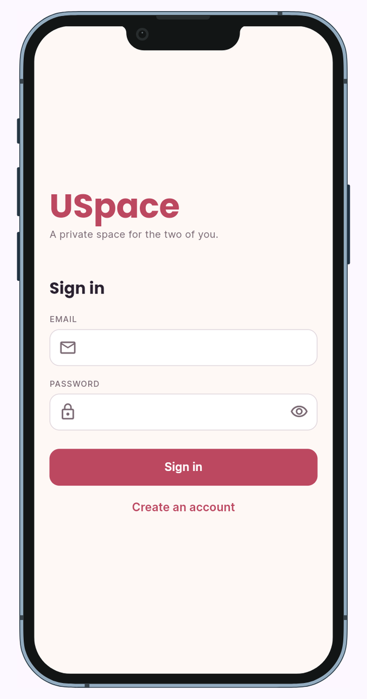
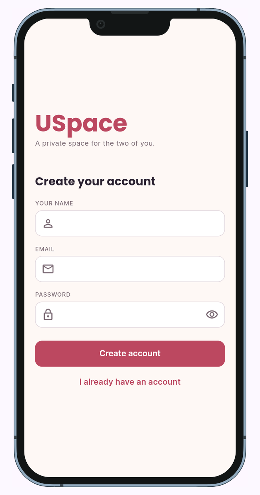
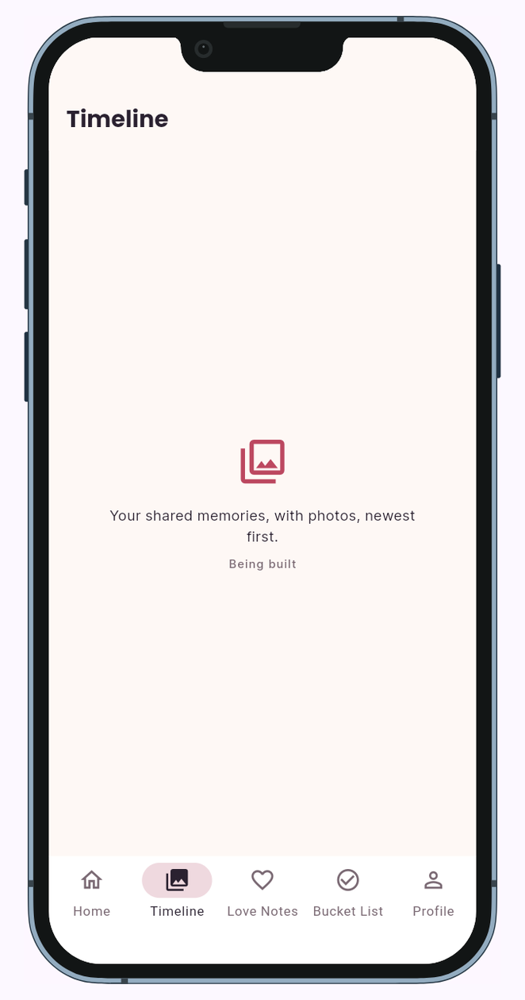
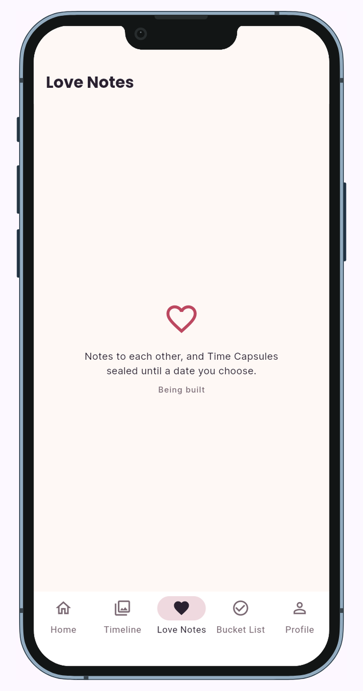
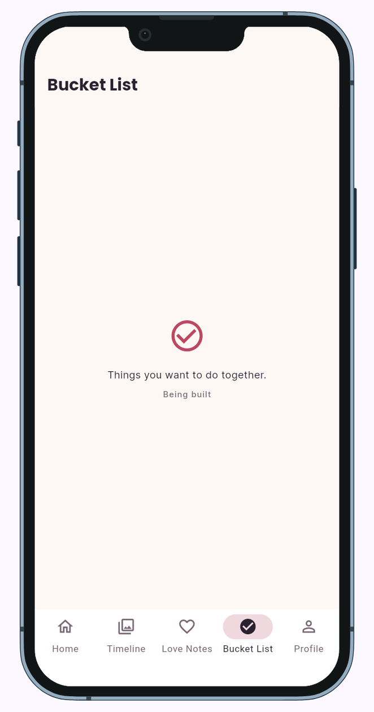

# USpace

> A private space for two people in one relationship.

**Live app:** https://h1enz.github.io/6ADET-FINAL-PROJECT--USpace-APP/
**Course:** Applications Development and Emerging Technologies (6ADET), Holy Angel University
**Author:** Mikko Panergo
**AI use:** Built with AI assistance (Claude, by Anthropic). What the AI wrote, what I changed, and what I wrote myself is recorded in [AI-USAGE.md](AI-USAGE.md).

---

## 1. Overview

USpace is a private app for couples, including long-distance ones. Two partners pair their accounts with an invite code and share one space that nobody else can see, starting with a countdown to their anniversary. The planned shared timeline, love notes, Time Capsules (notes sealed until a chosen date) and bucket list are being built week by week (see [section 7](#7-known-issues-and-next-steps)).

## 2. Setup and installation

### Versions

| | |
|---|---|
| Flutter | FLUTTER_VERSION (stable channel) |
| Dart | DART_VERSION |
| Minimum | Flutter 3.32 / Dart 3.8, set by `sdk: ^3.8.0` in `pubspec.yaml` |

You also need Git, Google Chrome, and a free [Supabase](https://supabase.com) account.

### Step 1: Get the code

```bash
git clone https://github.com/H1enZ/6ADET-FINAL-PROJECT--USpace-APP.git
cd 6ADET-FINAL-PROJECT--USpace-APP
flutter pub get
```

### Step 2: Create the database

1. In Supabase, create a new project.
2. Open **SQL Editor**, paste the whole of [`supabase/schema.sql`](supabase/schema.sql), and click **Run** once. You should see *Success. No rows returned*. This creates the tables, the security policies, the pairing functions and the private photo bucket.
3. Go to **Authentication > Sign In / Providers > Email** and turn off **Confirm email**, so test accounts with made-up emails can sign in straight away.

### Step 3: Add your configuration

The app needs two values from **Supabase > Project Settings > API Keys**. They go in a `.env` file, which is git-ignored and never committed.

```bash
cp .env.example .env              # macOS / Linux
Copy-Item .env.example .env       # Windows PowerShell
```

Open `.env` and replace the placeholders:

```
SUPABASE_URL=https://your-project-id.supabase.co
SUPABASE_PUBLISHABLE_KEY=sb_publishable_your_key_here
```

| Variable | What it is |
|---|---|
| `SUPABASE_URL` | Your Supabase project's address |
| `SUPABASE_PUBLISHABLE_KEY` | The public client key. It is safe in the app because the row-level security policies protect the data. Never use the **secret** key. |

## 3. How to run it

```bash
flutter run -d chrome --dart-define-from-file=.env
```

If your Flutter version does not accept `--dart-define-from-file`, pass the two values directly:

```bash
flutter run -d chrome --dart-define=SUPABASE_URL=https://your-project-id.supabase.co --dart-define=SUPABASE_PUBLISHABLE_KEY=sb_publishable_your_key_here
```

**When it works:** Chrome opens with the app inside a phone frame and shows the splash: the wax seal, "USpace" and "Checking your session…". When it is ready it says **"Tap anywhere to continue"**. Tap to open the **Sign in** screen.

**If you see "This build has no Supabase settings"**, the two values did not reach the app. Check that `.env` is in the project folder and that the names are spelled exactly as above.

**Tests:** `flutter test` runs the widget and countdown tests. The database security tests are described in [`supabase/test/README.md`](supabase/test/README.md).

## 4. Features and usage

The primary flow, screen by screen:

| # | Screen | What you do there | Where it goes |
|---|---|---|---|
| 1 | **Splash** | Shows the wax seal while it checks for a saved session. If you are not signed in, it waits for you to **tap anywhere to continue**. | Not signed in: tap to go to Sign in. Signed in but not paired: Pair, automatically. Paired: Home, automatically. |
| 2 | **Sign in** | Sign in with email and password, or tap **Create an account** to add your name and sign up. Passwords need at least 8 characters. | Pair (new account) or Home (already paired) |
| 3 | **Pair with your partner** | **Start our space** (optionally pick your anniversary date first) to get a 6-character invite code, or type your partner's code and tap **Join space**. | Home |
| 4 | **Home** | See both names and the anniversary card: days until your next anniversary, total days together, and a ring that fills through the year. Tap the card to set or change the date. Until your partner joins, a pink box shows the invite code with a copy button. Pull down to refresh. | Any tab |
| 5 | **Profile** | See your name and email. **Sign out** returns to Sign in. | Sign in |
| 6 | **Timeline, Love Notes, Bucket List** | Placeholders marked "Being built". | |

**Navigation:** a bottom bar with five tabs on phones, and a side rail on screens 840 px and wider. The theme follows the device's light or dark setting.

**Trying the two-person flow:** sign up in one browser and tap **Start our space**. In a *different* browser (a second private window in the same browser usually shares the first login), sign up with another email and join with the code. Pull down on Home in the first browser and both names appear.

**Privacy rules the app enforces** (in the database, not just the screens):

- You only ever see your own couple's data. Another couple sees none of it.
- A couple is exactly two people. A third person cannot join.
- Only the person who added a memory or note can edit or delete it.
- A sealed Time Capsule stays hidden from both partners until its unlock time.

## 5. Project structure

```
lib/
├── main.dart               Start-up: connects to Supabase, applies the theme, opens Splash
├── config.dart             Reads SUPABASE_URL and SUPABASE_PUBLISHABLE_KEY at build time
├── models/                 Plain data classes built from database rows
│   ├── couple.dart
│   └── profile.dart
├── services/               All Supabase calls live here, not in screens
│   ├── auth_service.dart   Sign up, sign in, sign out, readable error messages
│   └── couple_service.dart Profile, couple, members, create/join couple, anniversary
├── screens/                One file per screen (state is setState inside each)
│   ├── splash_screen.dart  Seal and session check, tap to continue; restartFlow() re-runs it
│   ├── sign_in_screen.dart
│   ├── pair_screen.dart
│   ├── main_shell.dart     Holds the five tabs
│   ├── home_screen.dart
│   ├── profile_screen.dart
│   ├── coming_soon_screen.dart
│   └── config_missing_screen.dart
├── theme/                  The design system from docs/03-design-system.md
│   ├── app_colors.dart     Light and dark colour schemes
│   ├── app_typography.dart Poppins and Inter type scale
│   ├── app_spacing.dart    4 dp spacing scale and corner radii
│   └── app_theme.dart      Builds ThemeData from the three files above
├── utils/
│   └── anniversary.dart    Countdown maths (pure Dart, unit tested)
└── widgets/                Reusable pieces, named as in the design system
    ├── atoms/              app_button, app_text_field, section_label, unlock_ring, seal_badge
    ├── molecules/          countdown_card
    └── organisms/          app_shell (bottom bar or side rail)

supabase/
├── schema.sql              Tables, row-level security, pairing functions, photo bucket
└── test/                   33 security checks run against schema.sql

test/                       Widget tests and countdown unit tests
docs/                       Proposal, mockup, design system, weekly reports, security checklist
```

**Where state lives:** each screen holds its own state with `setState`. Shared data lives in Supabase and is loaded through `services/`. Supabase keeps the login session, so a returning user stays signed in.

## 6. Screenshots

All screenshots use invented test accounts.

| Sign in | Create account |
|---|---|
|  |  |

| Timeline (placeholder) | Love Notes (placeholder) | Bucket List (placeholder) |
|---|---|---|
|  |  |  |

Still to add, retaken with test accounts: Splash, Pair, Home (waiting and paired), Profile, and the desktop layout.

## 7. Known issues and next steps

### Not built yet

- **Timeline, Love Notes, Time Capsules and Bucket List** are placeholder tabs. Their database tables and security policies already exist and are tested; the screens do not.
- **"Recent memories" on Home** always says "No memories yet", because memories cannot be added until Timeline exists.
- **No password reset.** The "Forgot password?" link from the mockup is not built.
- **No way to edit your name, leave a couple, or switch the theme** from Profile yet. The theme follows the device setting.

### Known issues

- **Partner joining does not update live.** The first partner has to pull down on Home to see that the second one has joined.
- **Sign in and Pair are two screens**, where the mockup shows them as one. Splitting them made the flow simpler to build; merging them is still open.
- **The setup steps have been tested through the automatic GitHub build, not yet on a fresh local machine.**
- **After a new deploy, the live link can show the old version** because the browser caches the app. Press Ctrl + Shift + R, or open it in a private window.
- **The Supabase free tier pauses a project after about a week without use.** If the live app cannot sign in, the project may need to be resumed from the Supabase dashboard.

### Next steps

1. Timeline: add memories with a photo, caption and date, stored in the private photo bucket.
2. Bucket List, written by me as my own-code section of `AI-USAGE.md`.
3. Love Notes, then Time Capsules with the wax seal and unlock countdown.
4. Profile: edit name, theme switch saved on the device.
5. Live updates when a partner joins or adds something.

---

## Privacy and secrets

- The app stores each person's email and display name, and everything the couple adds, in Supabase.
- Every table and the photo bucket are protected by row-level security in `supabase/schema.sql`: a row is visible only to the two members of its couple. Joining a couple is only possible through the invite-code function.
- Only the Supabase URL and publishable key are in the app. Locally they come from `.env`; for the live app they are GitHub repository secrets passed in by `.github/workflows/deploy-web.yml`. The secret (`service_role`) key is never in the app or the repo.
- All sample data, screenshots and the video use invented names and no real personal information.

## Project documentation

| Document | |
|---|---|
| [Proposal](docs/01-proposal.md) | The problem, the users, the scope |
| [Mockup and wireframes](docs/02-mockup.md) | What it looks like, and the screen flow |
| [Design system](docs/03-design-system.md) | Colours, type, spacing, components |
| [Weekly reports](docs/04-weekly-reports.md) | What happened each week |
| [Demo video](docs/05-demo-video.md) | The recording and what it shows |
| [Security and privacy](docs/06-security-and-privacy.md) | The checklist, filled in |
| [AI usage](AI-USAGE.md) | How AI was used, where it was wrong, and who wrote what |

## Credits

- Packages: `supabase_flutter` (sign-in and data), `google_fonts` (Poppins and Inter), `device_preview` (phone frame). Full list in `pubspec.yaml`.
- Fonts: Poppins and Inter, SIL Open Font License, via Google Fonts.
- AI assistance: Claude (Anthropic). Details in [AI-USAGE.md](AI-USAGE.md).

## Licence

MIT, see [LICENSE](LICENSE).