# USpace

> A private digital space that understands two people's relationship.

## Live demo: https://h1enz.github.io/USpace/

If the page shows an old version, press Ctrl + Shift + R or open it in a private window. Sign in with one of the [tester accounts](#tester-accounts) below.

**Course:** Applications Development and Emerging Technologies (6ADET), Holy Angel University
**Author:** Mikko Panergo
**AI use:** Built with AI assistance (Claude Code and OpenAI Codex). What the AI wrote, what I changed, and what I wrote myself (the Bucket List) is recorded in [AI-USAGE.md](AI-USAGE.md).

## Tester accounts

Two invented accounts, already paired as one couple, so you can try every feature and see both sides (chat, moods, notes, Time Capsules) without signing up. Use two different browsers, or one normal and one private window.

| | Email | Password |
|---|---|---|
| Tester A | testaccounts1@gmail.com | testaccounts1 |
| Tester B | testaccounts2@gmail.com | testaccounts2 |

These accounts hold only made-up data. Please do not add real personal information.

---

## 1. Overview

USpace is a private app for couples, including long-distance ones. Two partners pair their accounts with an invite code and share one space that nobody else can see. Everything in it belongs to the couple and is protected in the database, not only in the screens.

What is built (Weeks 1 to 3):

- **Home:** greeting, today's mood (shared with your partner automatically), a daily question, countdowns to your anniversary, birthdays and special days, a recent activity feed and quick actions.
- **Chat:** private realtime chat with reactions.
- **Timeline:** a scrapbook of memories with up to 10 photos, a story, location and tags, shown on an editable, zoomable corkboard with Polaroids, tape and decorations.
- **Love Notes:** letters in categories, with an optional photo.
- **Time Capsules:** notes and photos sealed until a chosen date, with a wax-seal opening ceremony. The sealed content stays hidden from both partners until then.
- **Moods:** pick a mood and it is shared; matching moods merge into one shared state.
- **Therabot:** a calm AI helper with Private Talk and Couple Reflection modes. What you say in private stays private.
- **Bucket List:** things to do together, with a location, a budget and a shared savings log (written by me, see [AI-USAGE.md](AI-USAGE.md)).
- **Profile / Settings:** photo, name, birthday, theme, unlink partner, sign out.

## 2. Setup and installation

### Versions

| | |
|---|---|
| Flutter | FLUTTER_VERSION (stable channel) |
| Dart | DART_VERSION |
| Minimum | Flutter 3.32 / Dart 3.8, set by `sdk: ^3.8.0` in `pubspec.yaml` |

You also need Git, Google Chrome, and a free [Supabase](https://supabase.com) account.

### Step 1: Get the code

```bash
git clone https://github.com/H1enZ/USpace.git
cd USpace
flutter pub get
```

### Step 2: Create the database

1. In Supabase, create a new project.
2. Open **SQL Editor**, paste the whole of [`supabase/schema.sql`](supabase/schema.sql), and click **Run** once. You should see *Success. No rows returned*. This creates the tables, the security policies, the pairing functions and the private photo bucket.
3. Go to **Authentication > Sign In / Providers > Email** and turn off **Confirm email**, so test accounts with made-up emails can sign in straight away.

### Step 3: Add your configuration

The app needs two values from **Supabase > Project Settings > API Keys**. They go in a `.env` file, which is git-ignored and never committed.

```bash
cp .env.example .env              # macOS / Linux
Copy-Item .env.example .env       # Windows PowerShell
```

Open `.env` and replace the placeholders:

```
SUPABASE_URL=https://your-project-id.supabase.co
SUPABASE_PUBLISHABLE_KEY=sb_publishable_your_key_here
```

| Variable | What it is |
|---|---|
| `SUPABASE_URL` | Your Supabase project's address |
| `SUPABASE_PUBLISHABLE_KEY` | The public client key. It is safe in the app because the row-level security policies protect the data. Never use the **secret** key. |

## 3. How to run it

```bash
flutter run -d chrome --dart-define-from-file=.env
```

If your Flutter version does not accept `--dart-define-from-file`, pass the two values directly:

```bash
flutter run -d chrome --dart-define=SUPABASE_URL=https://your-project-id.supabase.co --dart-define=SUPABASE_PUBLISHABLE_KEY=sb_publishable_your_key_here
```

**When it works:** Chrome opens with the app inside a phone frame and shows the splash: the wax seal, "USpace" and "Checking your session…". When it is ready it says **"Tap anywhere to continue"**. Tap to open the **Sign in** screen.

**If you see "This build has no Supabase settings"**, the two values did not reach the app. Check that `.env` is in the project folder and that the names are spelled exactly as above.

**Tests:** `flutter test` runs the widget and countdown tests. The database security tests are described in [`supabase/test/README.md`](supabase/test/README.md).

## 4. Features and usage

The primary flow, screen by screen:

| # | Screen | What you do there | Where it goes |
|---|---|---|---|
| 1 | **Splash** | Shows the wax seal while it checks for a saved session. If you are not signed in, it waits for you to **tap anywhere to continue**. | Not signed in: tap to go to Sign in. Signed in but not paired: Pair, automatically. Paired: Home, automatically. |
| 2 | **Sign in** | Sign in with email and password, or tap **Create an account** to add your name and sign up. Passwords need at least 8 characters. | Pair (new account) or Home (already paired) |
| 3 | **Pair with your partner** | **Start our space** (optionally pick your anniversary date first) to get a 6-character invite code, or type your partner's code and tap **Join space**. | Home |
| 4 | **Home** | See both names and the anniversary card: days until your next anniversary, total days together, and a ring that fills through the year. Tap the card to set or change the date. Until your partner joins, a pink box shows the invite code with a copy button. Pull down to refresh. | Any tab |
| 5 | **Timeline, Love Notes, Time Capsules, Chat, Therabot** | Add memories, write letters, seal a capsule, chat, or talk to Therabot. | Back to any tab |
| 6 | **Bucket List** | Add things to do together with a place and budget, log savings, tick items done. | Item page |
| 7 | **Profile** | Change your photo, name, birthday and theme. Unlink partner or **Sign out**. | Sign in |

**Navigation:** a bottom bar on phones, and a side rail on screens 840 px and wider. The theme follows the device's light or dark setting.

**Fastest way to try it:** sign in with the two [tester accounts](#tester-accounts) above, one per browser.

**Trying the two-person flow with your own accounts:** sign up in one browser and tap **Start our space**. In a *different* browser (a second private window in the same browser usually shares the first login), sign up with another email and join with the code. Pull down on Home in the first browser and both names appear.

**Privacy rules the app enforces** (in the database, not just the screens):

- You only ever see your own couple's data. Another couple sees none of it.
- A couple is exactly two people. A third person cannot join.
- Only the person who added a memory or note can edit or delete it.
- A sealed Time Capsule stays hidden from both partners until its unlock time.

## 5. Project structure

```
lib/
├── main.dart               Start-up: connects to Supabase, applies the theme, opens Splash
├── config.dart             Reads SUPABASE_URL and SUPABASE_PUBLISHABLE_KEY at build time
├── models/                 Plain data classes built from database rows
├── services/               All Supabase calls live here, not in screens
│   └── couple_sync.dart    One live-update service per couple (realtime)
├── screens/                One file per screen; subfolders for Therabot and Time Capsules
├── theme/                  Colours, typography, spacing, ThemeData (docs/03-design-system.md)
├── utils/                  Pure Dart helpers (countdown maths, money), unit tested
└── widgets/                atoms / molecules / organisms, as in the design system

assets/                     3D mood artwork, chat reaction artwork, USpace line icons
supabase/
├── schema.sql              Base tables, row-level security, pairing functions, photo buckets
├── migrations/             002 to 021: one file per later change
├── functions/              Edge Functions: Therabot, capsule-photo
└── test/                   Security checks against the database rules (see its README)

test/                       Widget and unit tests
docs/                       Proposal, mockup, design system, weekly reports, journal, security checklist
```

**Where state lives:** each screen holds its own state with `setState`. Shared data lives in Supabase and is loaded through `services/`; `couple_sync.dart` keeps it fresh through realtime channels. Supabase keeps the login session, so a returning user stays signed in.

## 6. Screenshots

Taken on 8 October 2026 from the live demo, signed in with the two [tester accounts](#tester-accounts). The test couple has sample data: six memories on the Timeline (with three frame styles and a sticky note), a love note, a sealed Time Capsule, shared moods, chat messages, a finished Therabot reflection and a Bucket List goal. All of it is invented, and the pictures were drawn for this project.

| Sign in | Pair | Home |
|---|---|---|
| 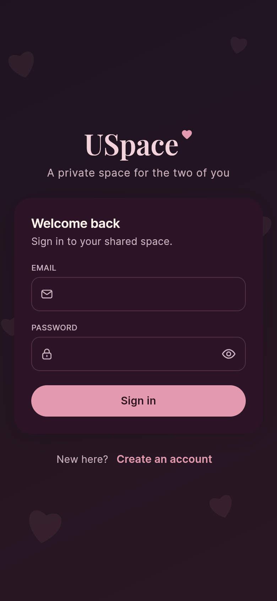 | 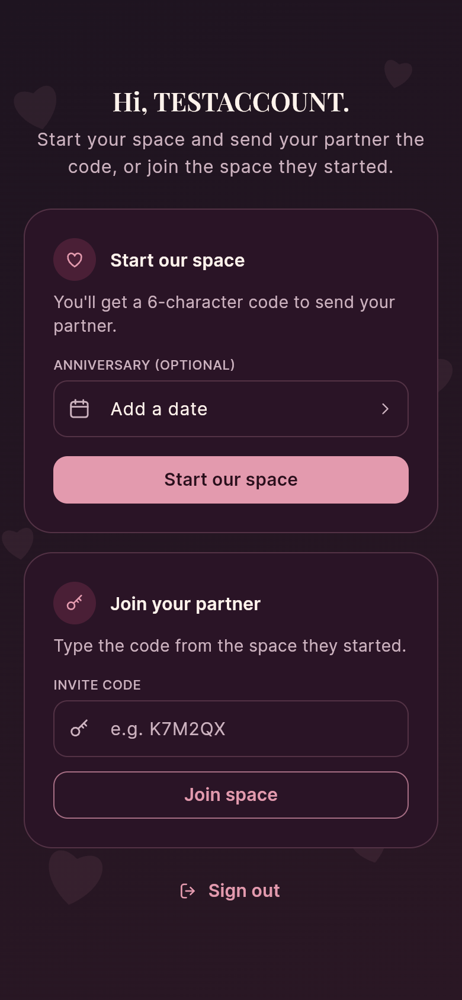 | 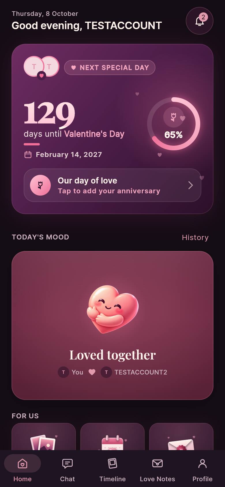 |

| Different moods | Same mood, merged | Home, For us |
|---|---|---|
| 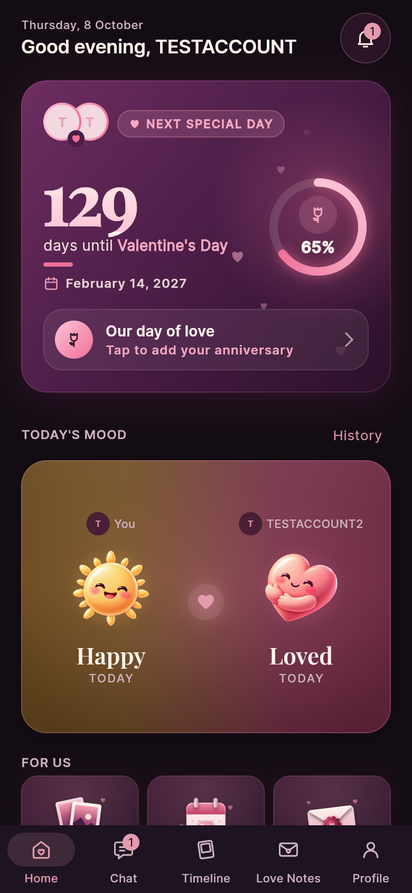 | 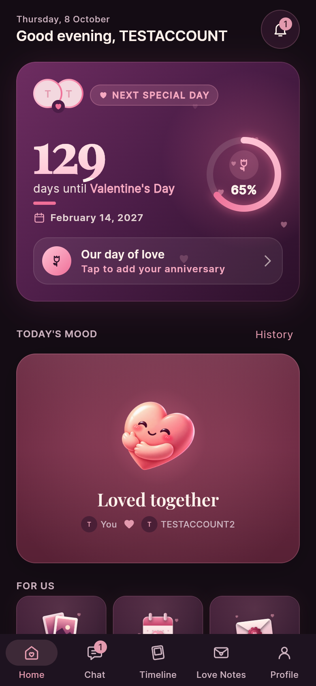 | 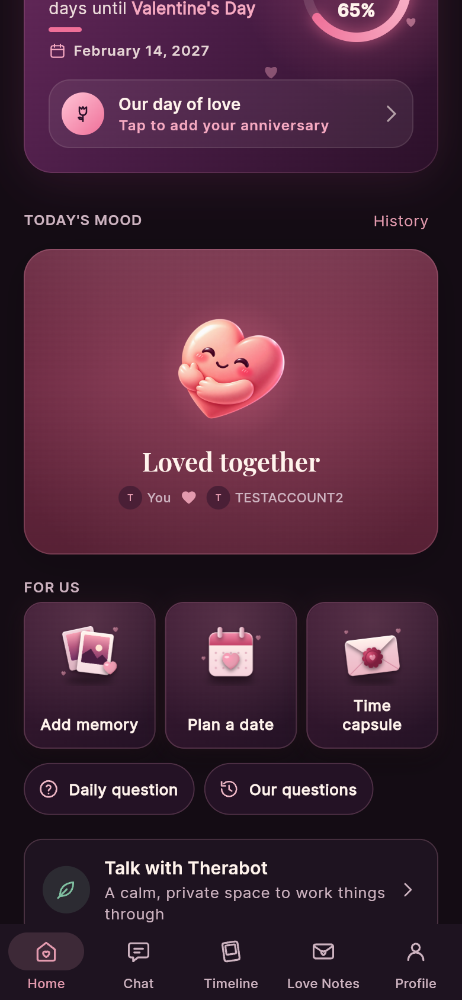 |

| Chat | Timeline | Timeline, customized |
|---|---|---|
| 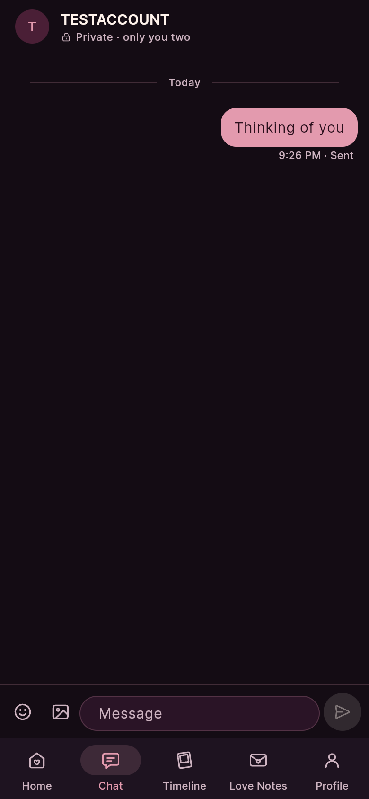 | 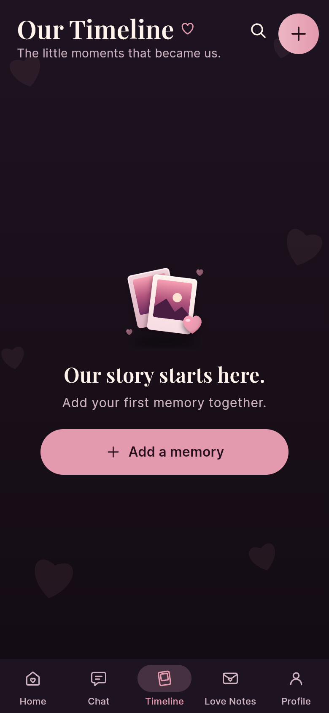 | 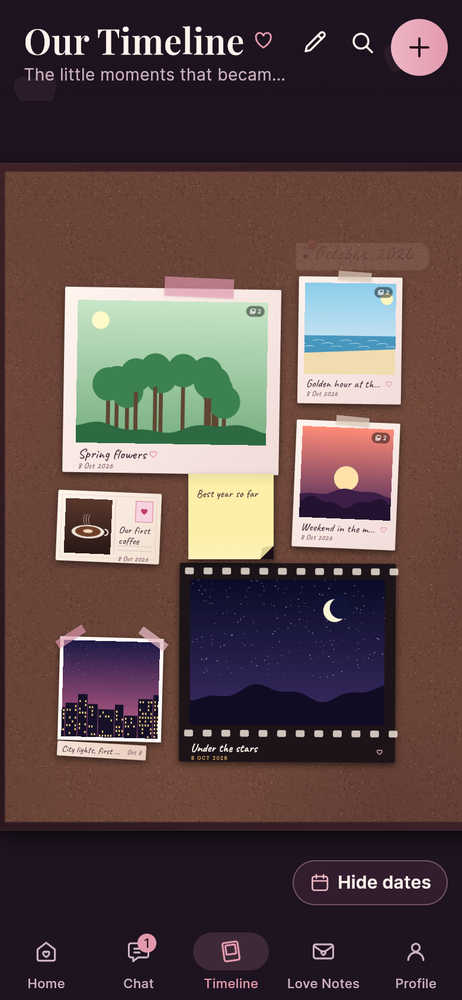 |

| Love Notes | Time capsule preview | Capsule sealed |
|---|---|---|
| 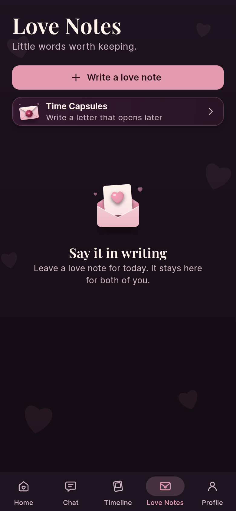 | 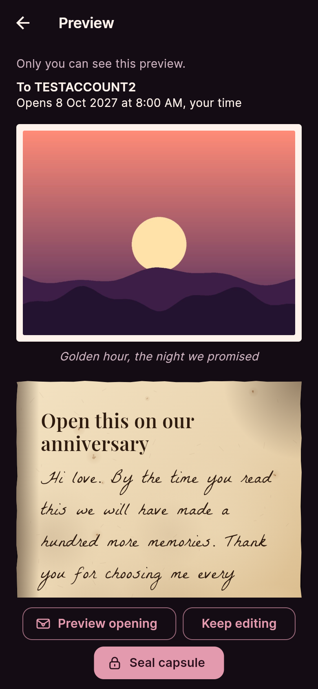 | 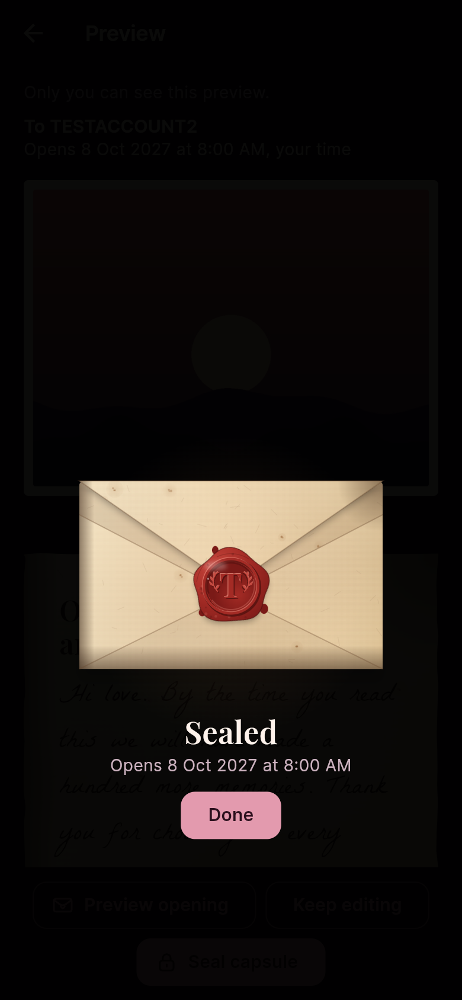 |

| Time Capsules list | Therabot | Therabot privacy |
|---|---|---|
| 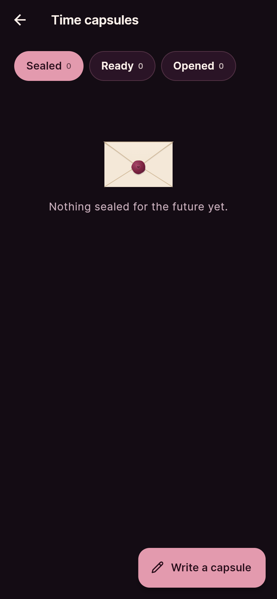 | 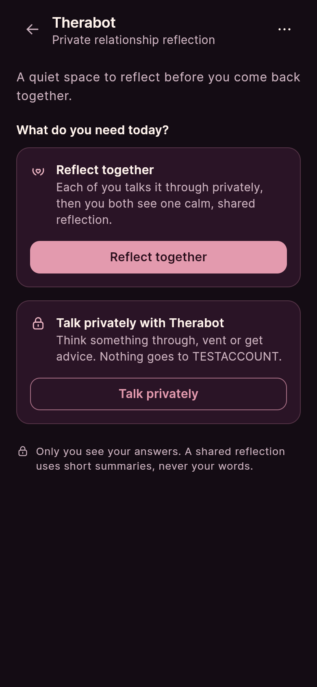 | 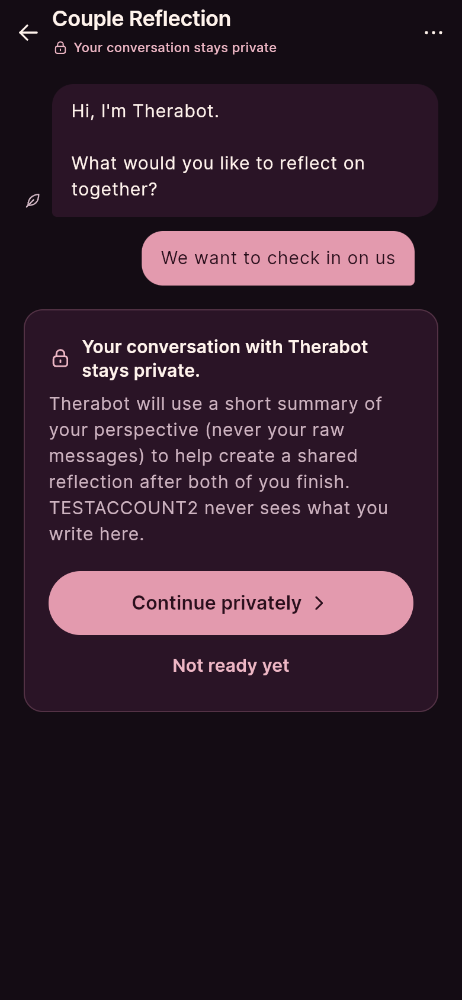 |

| Therabot, private chat | Therabot, both finished | Shared reflection |
|---|---|---|
| 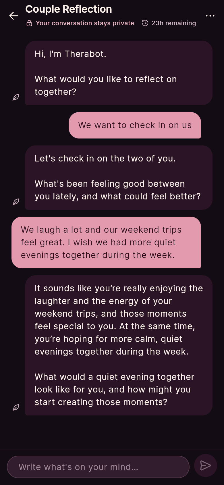 | 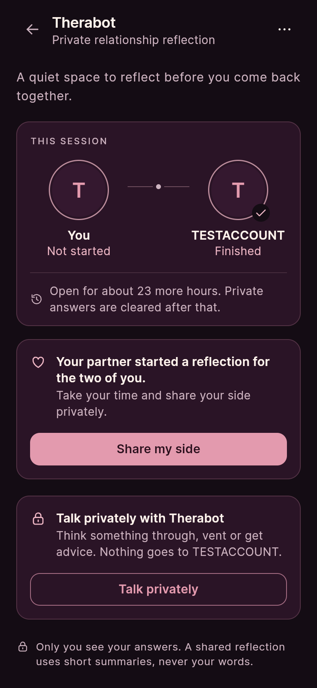 | 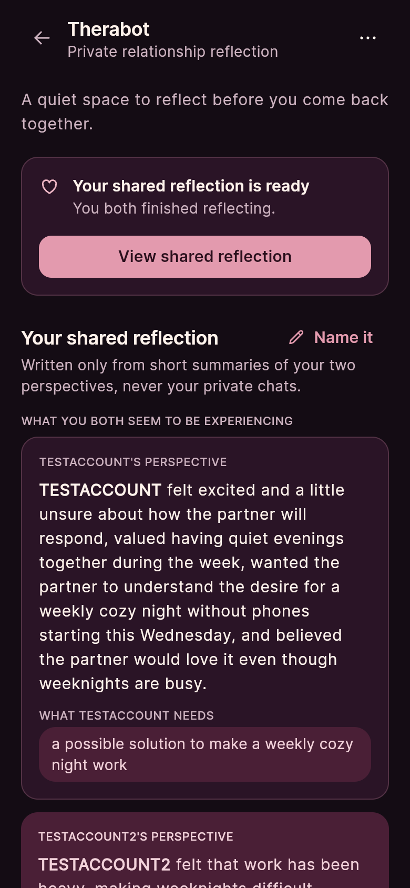 |

| Bucket List | Savings log | Profile |
|---|---|---|
| 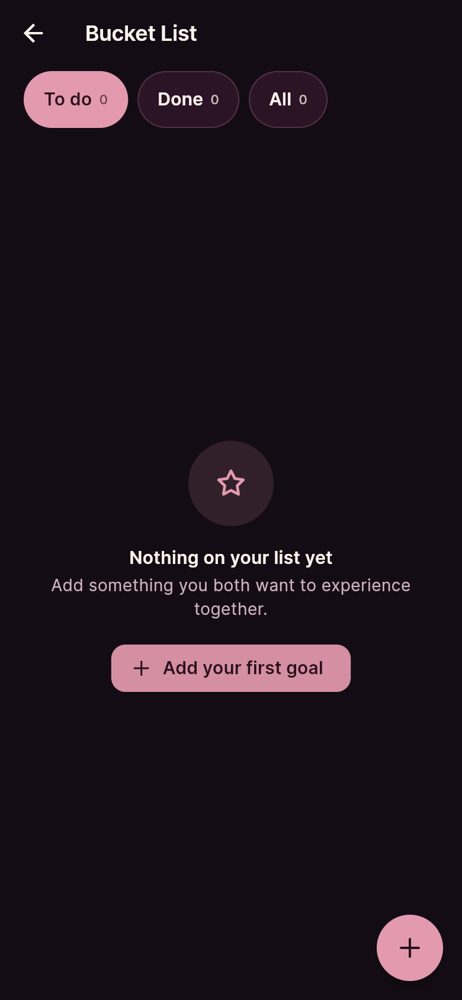 | 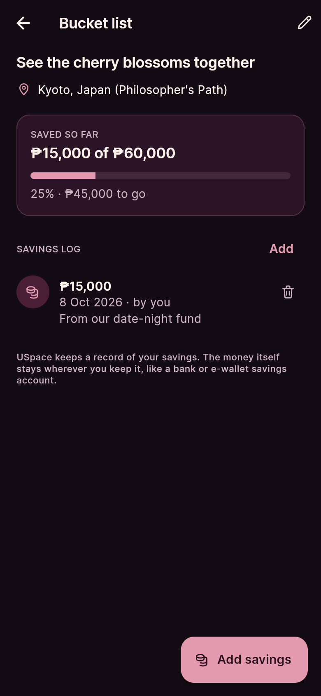 | 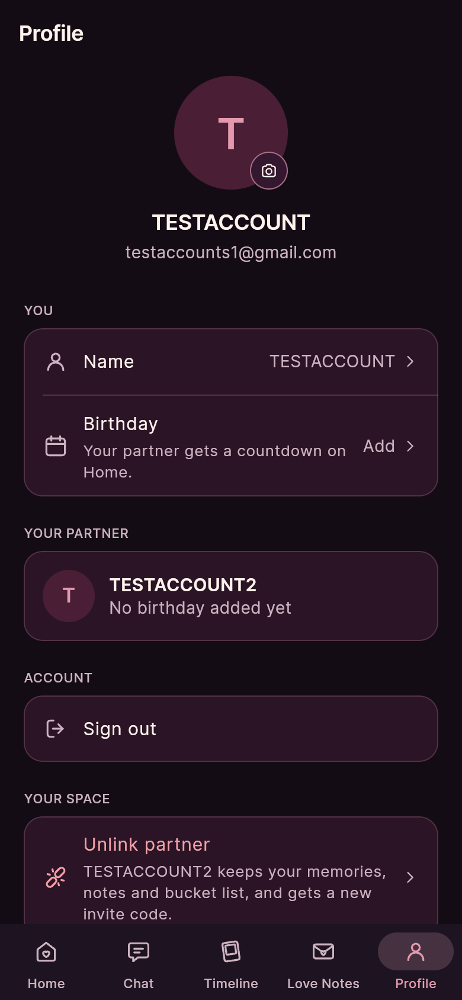 |

## 7. Known issues and next steps

### Known issues

- **No password reset.** The "Forgot password?" link from the mockup is not built.
- **Sign in and Pair are two screens**, where the mockup shows them as one.
- **Security audit (8 October 2026): no critical or high issues, 3 medium ones**, being fixed in stages: email confirmation is off on the live project, some broadcast channels were public (migration 021 makes them private), and pairing codes. Details in [docs/06-security-and-privacy.md](docs/06-security-and-privacy.md).
- **After a new deploy, the live link can show the old version** because the browser caches the app. Press Ctrl + Shift + R, or open it in a private window.
- **The Supabase free tier pauses a project after about a week without use.** If the live app cannot sign in, the project may need to be resumed from the Supabase dashboard.

### Next steps

1. Finish the security fixes from the audit.
2. Record the demo video (see [the demo plan](docs/05-demo-video.md)).
3. Password reset.
4. Finish the final documents.

---

## Privacy and secrets

- The app stores each person's email and display name, and everything the couple adds, in Supabase.
- Every table and the photo bucket are protected by row-level security in `supabase/schema.sql`: a row is visible only to the two members of its couple. Joining a couple is only possible through the invite-code function.
- Only the Supabase URL and publishable key are in the app. Locally they come from `.env`; for the live app they are GitHub repository secrets passed in by `.github/workflows/deploy-web.yml`. The secret (`service_role`) key is never in the app or the repo.
- All sample data, screenshots and the video use invented names and no real personal information.

## Project documentation

| Document | |
|---|---|
| [Proposal](docs/01-proposal.md) | The problem, the users, the scope |
| [Mockup and wireframes](docs/02-mockup.md) | What it looks like, and the screen flow |
| [Design system](docs/03-design-system.md) | Colours, type, spacing, components |
| [Weekly reports](docs/04-weekly-reports.md) | What happened each week |
| [Project journal](docs/journal) | My reflections, week by week |
| [Weekly documentation](docs/documentation) | The seven required sections, per week |
| [Weekly increment report](docs/REPORT.md) | What changed, why, what broke |
| [Reflection](docs/REFLECTION.md) | What I learned and my role in the project |
| [Demo video](docs/05-demo-video.md) | The recording and what it shows |
| [Security and privacy](docs/06-security-and-privacy.md) | The checklist, filled in |
| [AI usage](AI-USAGE.md) | How AI was used, where it was wrong, and who wrote what |

## Credits

- Packages: `supabase_flutter` (sign-in and data), `google_fonts` (Playfair Display, Inter and handwriting fonts), `flutter_svg` (line icons), `image_picker`, `shared_preferences`, `device_preview` (opt-in phone frame). Full list in `pubspec.yaml`.
- Fonts: Playfair Display, Inter, Lora, Caveat and La Belle Aurore, SIL Open Font License, via Google Fonts.
- AI assistance: Claude Code (Anthropic) and OpenAI Codex. Details in [AI-USAGE.md](AI-USAGE.md).

## Licence

MIT, see [LICENSE](LICENSE).
