# Mockup and wireframes

The visual plan for **USpace**. The wireframes answered what goes where; the mockup shows what it looks like. Both are drawn at 360 × 780 dp (phone) and 1280 × 800 dp (desktop, the ≥ 840 dp breakpoint).

Everything on the mockup is real: the palette and type come from [the design system](03-design-system.md), the content is invented but plausible, and the photos are illustrated stand-ins.

## Mockup

### All six screens, in journey order

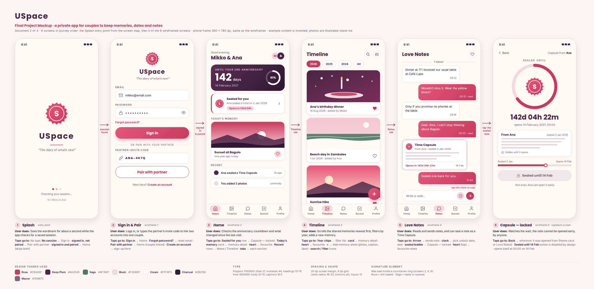

### Desktop / tablet, ≥ 840 dp

The same six screens with the bottom nav replaced by a side rail. Two sheets.

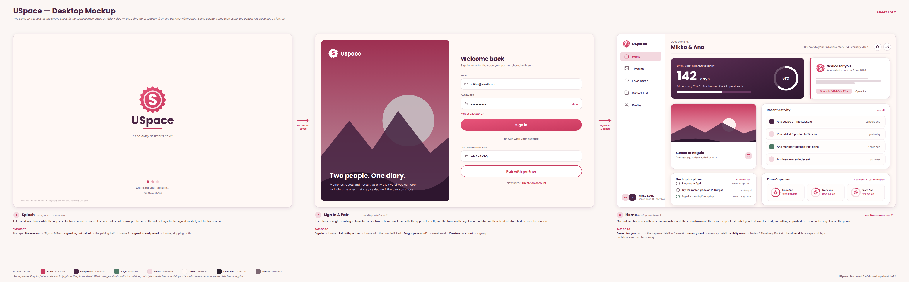

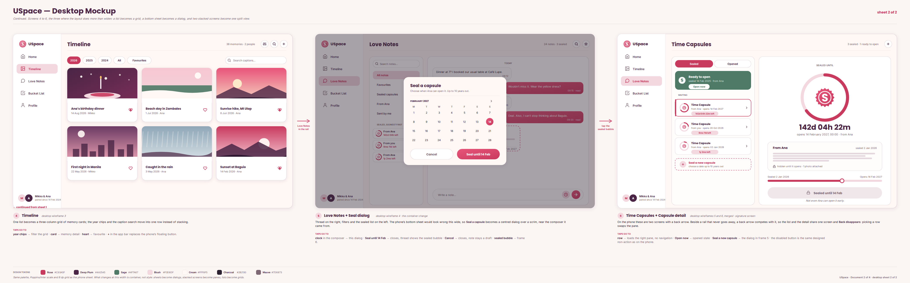

### What painting the wireframes in revealed

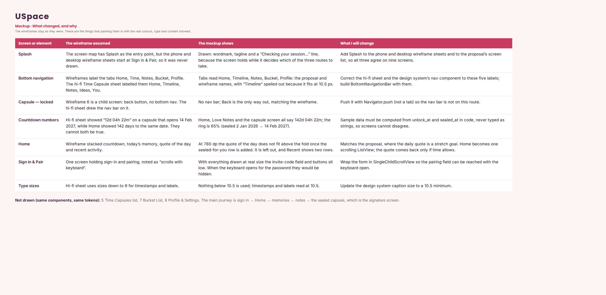

Full document, all sheets in one file: [USpace_Mockup_Full.pdf](assets/USpace_Mockup_Full.pdf)

## Wireframes

The box-and-label sketches from the prelim. They have not been redrawn — the mockup is a layer on top of them.

### Screen map and navigation flow

Splash is the entry point and decides between three routes: no saved session → Sign in; signed in but not paired → Pair with partner; signed in and paired → Home, skipping both. Five screens sit in the persistent nav; eight are child screens, each with a back route. Sign out is the only path that leaves the paired state.

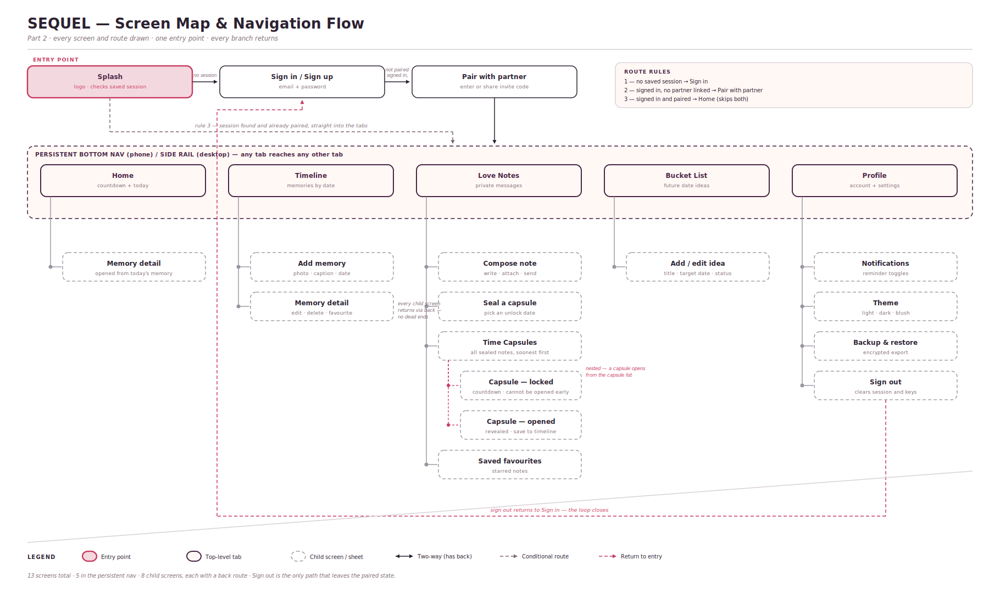

### Phone, 360 dp

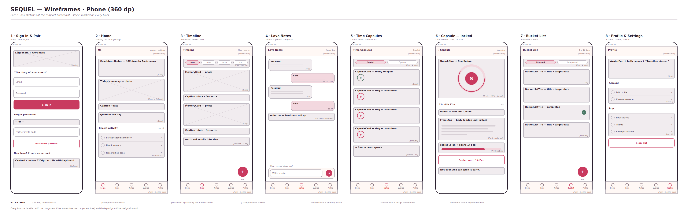

### Desktop / tablet, ≥ 840 dp

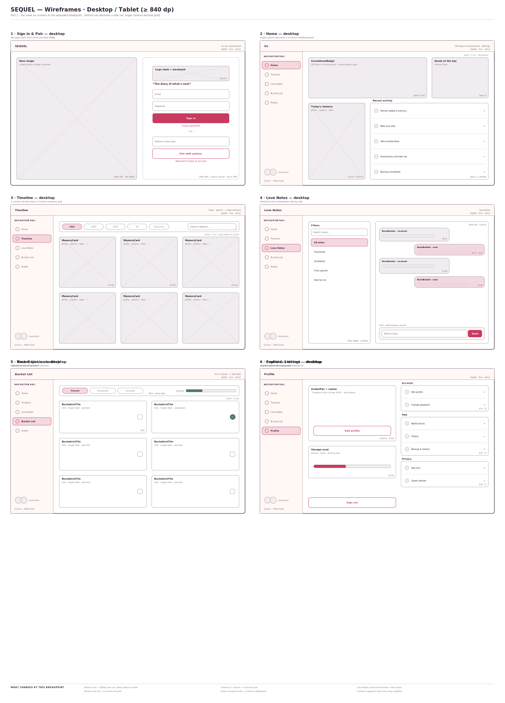

### Component tree

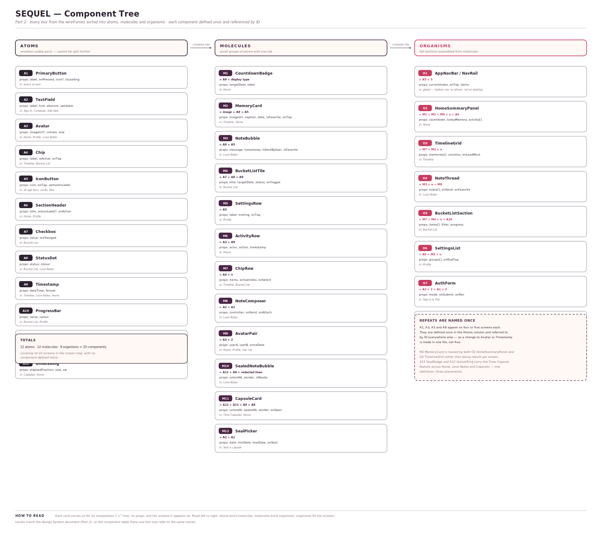

### Sanity-check walkthrough

One whole task traced tap by tap across both widths: Ana seals a Time Capsule on 2 January; Mikko opens it 142 days later and saves it to the timeline. It is what caught four routing gaps, listed on the sheet.

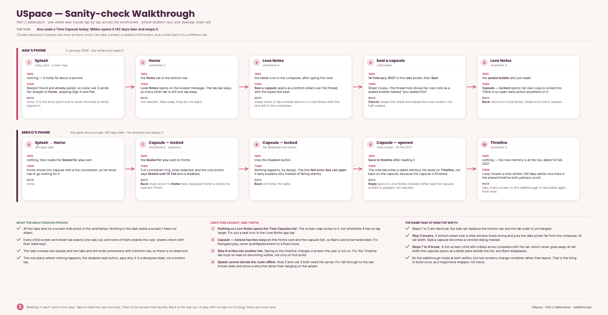

## Screens

### 1 · Splash

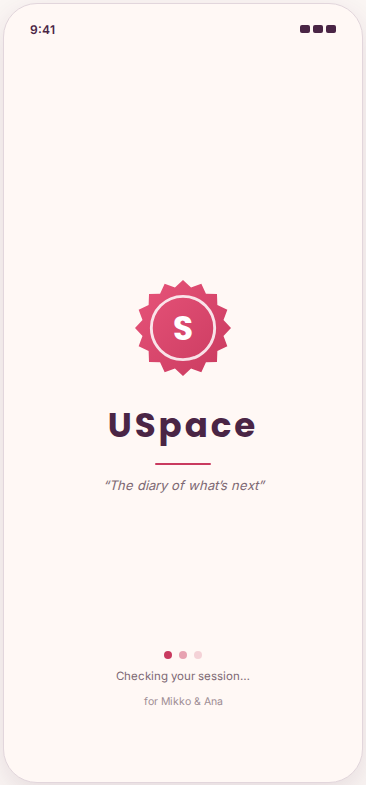

**On it:** wordmark, tagline, and a "Checking your session…" line while the app decides where to go.

**The user does:** nothing. It holds for about a second.

**Where it goes:** no saved session → Sign in & Pair · signed in, not paired → the pairing half of the same screen · signed in and paired → Home. No side rail or bottom nav yet — those belong to the signed-in shell.

### 2 · Sign in & Pair

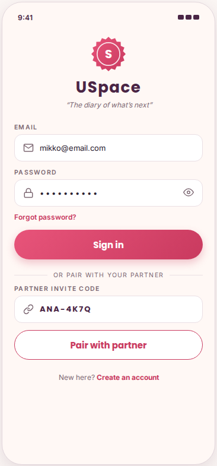

**On it:** email and password, and below the divider, the partner invite code. One screen, because pairing is the same moment as signing in for a second partner.

**The user does:** signs in, or types the code the other partner shared.

**Where it goes:** **Sign in** → Home · **Pair with partner** → Home with the couple linked · **Forgot password?** → reset email · **Create an account** → sign-up. On desktop this splits into a hero panel and a form column; the form keeps a readable width instead of stretching.

### 3 · Home

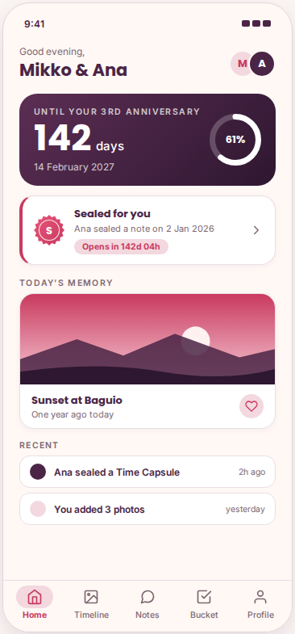

**On it:** the anniversary countdown with a progress ring, any capsule sealed for you, today's memory, and recent activity. Desktop adds "Next up together" and a capsule strip in a third row.

**The user does:** checks the countdown and what changed since the last visit.

**Where it goes:** **Sealed for you** → Capsule — locked · **today's memory** → memory detail · **heart** → favourite · **activity rows** → Notes / Timeline / Bucket · **tabs** → each section.

### 4 · Timeline

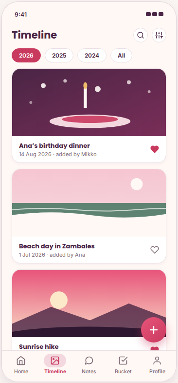

**On it:** shared memories newest first, filtered by year. One column on a phone, a three-column grid on desktop.

**The user does:** scrolls the memories, filters by year, adds a new one.

**Where it goes:** **year chips** → filter the list · **card** → memory detail · **heart** → favourite · **+** → Add memory sheet (photo, caption, date) · **search / filter** icons in the app bar.

### 5 · Love Notes

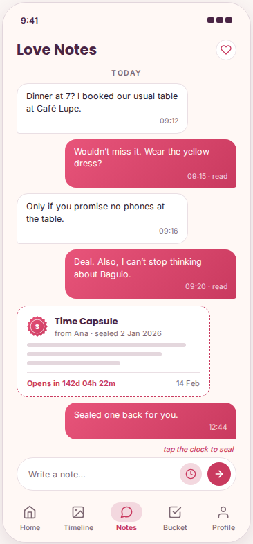

**On it:** the thread, with a sealed capsule sitting inline among ordinary notes — seal, countdown and redacted lines, never the words.

**The user does:** reads and sends notes, or seals one as a Time Capsule.

**Where it goes:** **arrow** → sends the note · **clock** → pick an unlock date and seal · **sealed bubble** → Capsule — locked · **heart** in the app bar → favourite notes. The seal picker is a bottom sheet under 840 dp and a centred dialog above it.

### 6 · Capsule — locked

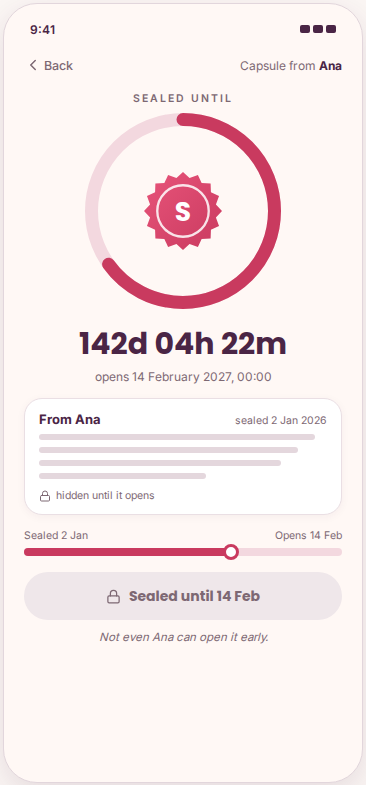

The signature screen.

**On it:** the countdown ring around the wax seal, the exact unlock moment, the note redacted, a progress bar from sealed to opens, and a disabled button reading "Sealed until 14 Feb".

**The user does:** waits. This is the one screen whose main action is deliberately unavailable, and it says so: *not even Ana can open it early*.

**Where it goes:** **Back** → wherever it was opened from — Home or Love Notes, so the route is popped rather than hardcoded. It opens itself at 00:00 on the unlock date and can then be saved to the Timeline. On desktop there is no back arrow: the capsule list and this detail share one screen, and picking a row swaps the pane.

### Not drawn

**Time Capsules** (the list of sealed notes), **Bucket List** and **Profile & Settings** use the same components and tokens as the six above, and appear in the wireframes and the component tree.
