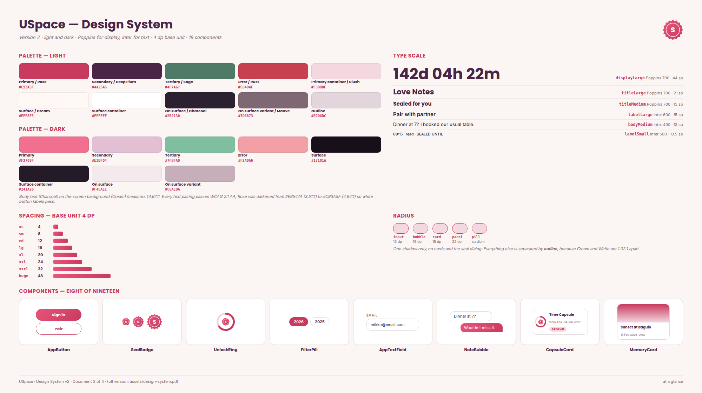

# Design system

The reference I open every time I build a screen. Everything below is what goes into `lib/theme/` on day one — no placeholder values.

[Design system (PDF, 8 pages)](assets/design-system.pdf) — the full version: every role, both schemes as Dart, all 19 components with their constructors, and the screens × components matrix.

**Theme mode: light and dark.** Decided now rather than retrofitted, because the Profile screen has a theme switch and a light-only app would ship a control that does nothing. **Fonts:** Poppins for display and titles, Inter for everything the user reads, both through `google_fonts`.

## Palette

Roles, not colour names. Every pairing was measured with the WCAG 2.1 relative-luminance formula.

### Light

| Role | Hex | Used for | Contrast |
|---|---|---|---|
| `primary` | `#C93A5F` | Buttons, active tab, links, countdown ring | 4.94:1 with white |
| `secondary` | `#4A2545` | Countdown card, app bar, high-emphasis headings | 12.79:1 with white |
| `tertiary` | `#4F7A67` | Completed bucket items, a capsule ready to open | 4.87:1 with white |
| `error` | `#C6404F` | Validation errors, destructive actions | 4.94:1 with white |
| `primaryContainer` | `#F3D8DF` | Selected tab pill, countdown chips, badges | 11.52:1 with Charcoal |
| `surface` | `#FFF8F5` | Screen background | base |
| `surfaceContainerHighest` | `#FFFFFF` | Cards, sheets, dialogs, inputs | 1.02:1 on Cream — separated by outline, not contrast |
| `onSurface` | `#2B2130` | Body text and titles | **14.67:1 on Cream** |
| `onSurfaceVariant` | `#7D6873` | Timestamps, captions, secondary labels | 4.88:1 on Cream |
| `outline` | `#E2D6DC` | Card and input borders | non-text |

**Rose is `#C93A5F`, not `#E8547A`.** The lighter one measured 3.51:1 against white button text and failed AA. It survives only as the top of the countdown-card gradient, where it carries no text.

### Dark

| Role | Hex | Contrast on surface |
|---|---|---|
| `primary` | `#F2708F` | 6.65:1 |
| `onPrimary` | `#3A0A19` | 6.05:1 on primary |
| `primaryContainer` / `onPrimaryContainer` | `#5E2238` / `#FFD9E2` | 9.24:1 |
| `secondary` | `#E3BFD4` | 11.26:1 |
| `tertiary` | `#7FBFA0` | 8.76:1 |
| `error` | `#F2A0A6` | 9.20:1 |
| `surface` / `surfaceContainerHighest` | `#17101A` / `#241A28` | base / raised |
| `onSurface` | `#F4EAEE` | 15.86:1 |
| `onSurfaceVariant` | `#C6AEBA` | 9.03:1 |

Both live in `lib/theme/app_colors.dart` as `AppColors.light` and `AppColors.dark`, wired up by `AppTheme` in `lib/theme/app_theme.dart`. `themeMode` comes from the Profile switch, stored in `shared_preferences`.

## Type scale

Six styles on named Material slots, in `lib/theme/app_typography.dart`. Used by name — `Theme.of(context).textTheme.titleLarge` — never as an inline `fontSize`.

| Slot | Font | Size | Weight | Used for |
|---|---|---|---|---|
| `displayLarge` | Poppins | 44 sp | 700 | Countdown numerals on Home and the capsule detail |
| `titleLarge` | Poppins | 21 sp | 700 | Screen titles in the app bar |
| `titleMedium` | Poppins | 15 sp | 700 | Card titles and dialog headings |
| `labelLarge` | Inter | 15 sp | 600 | Button labels |
| `bodyMedium` | Inter | 13 sp | 400 | Notes, captions, list rows — the default |
| `labelSmall` | Inter | 10.5 sp | 500 | Timestamps and small-caps section labels |

**10.5 sp is the floor.** Nothing goes below it. All six use relative line heights and no fixed-height text boxes, so `textScaleFactor` up to 2.0 grows rows instead of clipping them; the countdown numeral is capped with `maxLines: 1` inside a `FittedBox`.

## Spacing

**The base unit is 4 dp.** Every gap is a multiple of it, and the working rhythm inside a screen is 8 or 16. In `lib/theme/app_spacing.dart`.

| Token | Value | Used for |
|---|---|---|
| `xs` | 4 | Icon-to-label, chip padding |
| `sm` | 8 | Between related rows, chip gaps |
| `md` | 12 | Inside cards, title to subtitle |
| `lg` | 16 | Card padding, gap between cards |
| `xl` | 20 | Screen side margin on phone |
| `xxl` | 24 | Section spacing, desktop card padding |
| `xxxl` | 32 | Between major blocks on desktop |
| `huge` | 48 | Empty states, the splash block |

Semantic aliases: `screenMargin` (20), `screenMarginWide` (24), `cardPadding` (16), `touchTarget` (48), `railWidth` (220), `navBarHeight` (64).

**Radius** (`AppRadius`): `chipBar` 4, `input` 13, `bubble` 16, `card` 18, `panel` 22, `pill` stadium.
**Elevation** (`AppElevation.card`): one shadow, on cards and the seal dialog. Everything else is separated by `outline`.

**Breakpoints:** Compact `< 600 dp` — single column, bottom nav, seal picker as a bottom sheet. Medium `600–840 dp` — Timeline becomes two columns. Expanded `≥ 840 dp` — side rail, three-column Timeline, seal picker as a centred dialog, and the capsule list and detail share one screen.

## Components

Nineteen widgets, every one used on more than one screen or more than once on a screen.

| Component | What it is | File | Parameters | Screens |
|---|---|---|---|---|
| `AppButton` | Filled, outlined and disabled button in one widget | `lib/widgets/atoms/app_button.dart` | `label`, `onPressed` (null → disabled style), `variant`, `icon?`, `isLoading`, `fullWidth` | Sign in & Pair, Seal dialog, Capsule detail, Profile, Timeline sheet |
| `SealBadge` | The wax seal — the app's signature mark | `lib/widgets/atoms/seal_badge.dart` | `size` (22 / 30 / 46), `state` (sealed \| broken), `color?` | Splash, Home, Love Notes, Time Capsules, Capsule detail |
| `UnlockRing` | Progress ring that fills as the wait elapses | `lib/widgets/atoms/unlock_ring.dart` | `elapsedFraction`, `size`, `strokeWidth`, `child?` | Home, Time Capsules, Capsule detail |
| `AppTextField` | Labelled input with the small-caps label above | `lib/widgets/atoms/app_text_field.dart` | `label`, `controller`, `hintText?`, `prefixIcon?`, `obscureText`, `suffix?`, `validator?` | Sign in & Pair, Add memory, Add bucket item, Profile |
| `FilterPill` | Selectable pill with an optional count badge | `lib/widgets/atoms/filter_pill.dart` | `label`, `selected`, `onTap`, `count?` | Timeline (years), Love Notes (filters), Time Capsules, Bucket List |
| `AvatarCircle` | Initials or photo, optionally overlapped as a pair | `lib/widgets/atoms/avatar_circle.dart` | `initials`, `imageUrl?`, `size`, `overlapped` | Home, Profile, side rail, Timeline |
| `SectionLabel` | Small-caps section heading with an optional action | `lib/widgets/atoms/section_label.dart` | `text`, `actionLabel?`, `onAction?` | Every screen |
| `CountdownText` | Live countdown computed from a date, never a string | `lib/widgets/atoms/countdown_text.dart` | `target` (`DateTime`), `format` (long \| days), `style?` | Home, Love Notes, Time Capsules, Capsule detail |
| `CountdownCard` | The plum anniversary card with its ring | `lib/widgets/molecules/countdown_card.dart` | `anniversary`, `label`, `subtitle?`, `onTap?` | Home |
| `MemoryCard` | Photo, caption, date, favourite — list or grid | `lib/widgets/molecules/memory_card.dart` | `memory`, `onTap`, `onFavourite`, `layout` (list \| grid) | Timeline, Home |
| `NoteBubble` | One note in the thread, sent or received | `lib/widgets/molecules/note_bubble.dart` | `note`, `isMine`, `onLongPress?` | Love Notes |
| `SealedNoteBubble` | A capsule inline in the thread — seal, countdown, redacted lines | `lib/widgets/molecules/sealed_note_bubble.dart` | `capsule`, `onTap`, `isMine` | Love Notes |
| `CapsuleCard` | A capsule as a row or a highlight card | `lib/widgets/molecules/capsule_card.dart` | `capsule`, `onTap`, `selected`, `style` (row \| highlight) | Home, Time Capsules |
| `BucketListTile` | Date idea with its done state | `lib/widgets/molecules/bucket_list_tile.dart` | `item`, `onToggle`, `onEdit?`, `dense` | Bucket List, Home |
| `ActivityRow` | One line of recent activity with a relative time | `lib/widgets/molecules/activity_row.dart` | `title`, `when` (`DateTime`), `dotColor`, `onTap?` | Home |
| `SealPicker` | Date picker for sealing — sheet on phone, dialog on desktop | `lib/widgets/molecules/seal_picker.dart` | `show(context, initialDate, maxDate?)` → `Future<DateTime?>` | Love Notes, Time Capsules |
| `AppShell` | Navigation shell: `NavigationBar` under 840 dp, `NavigationRail` above | `lib/widgets/organisms/app_shell.dart` | `currentIndex`, `onDestinationSelected`, `child` | All five tabs, both widths |
| `NoteComposer` | Write bar with send and seal actions | `lib/widgets/organisms/note_composer.dart` | `onSend`, `onSealTapped`, `controller?` | Love Notes |
| `CapsuleDetailPane` | The full capsule view: ring, countdown, redacted body, actions | `lib/widgets/organisms/capsule_detail_pane.dart` | `capsule`, `onSaveToTimeline`, `onReply?`, `showBackButton` | Capsule — locked, Capsule — opened, Time Capsules (desktop) |

**Conventions.** Each takes a model rather than loose fields. None reads a colour or size literal — everything comes from `Theme.of(context)`, which is what makes the dark scheme work for free. None navigates: callbacks go out and the screen decides. Everything tappable meets the 48 dp minimum.

**Deliberately not components:** `HomeSummaryPanel` (it was the whole screen wearing a component's name), screen scaffolds (the shared part is already `AppShell`), and Splash (a route that decides where to go, so its logic belongs in routing).

## Changes since the last version

**20 Sep 2026 — v2, written after the mockup.**

- **Palette written as a real `ColorScheme`.** The prelim's `color.primary` style tokens could not be pasted into a project. Building screens also showed I needed container and on-container roles for the blush pills and the sage ready-to-open card.
- **Dark scheme added.** The prelim assumed light. My Profile wireframe already draws a theme switch, so light-only would ship a dead control.
- **Rose `#C93A5F` kept**, not revisited: the mockup put white labels on rose in five places and the measured 4.94:1 still passes.
- **Type scale re-measured at 360 dp.** Countdown 28 → 44 sp, body 15 → 13 sp, and a 10.5 sp floor after the hi-fi sheet drifted to 9 sp.
- **Spacing base unit stated: 4 dp.** This was the feedback on the prelim, and it resolved a real contradiction — my mockup legend claimed an 8 dp grid while using a 20 dp margin. 20 is 5 × 4.
- **Components 9 → 19**, each with a file path and a constructor. The seal family (`SealBadge`, `UnlockRing`, `SealedNoteBubble`, `CapsuleCard`, `SealPicker`, `CapsuleDetailPane`) did not exist at prelim because Time Capsule did not either.
- **`AppNavBar` → `AppShell`.** The desktop mockup showed the rail is the same component at a different width, not a second widget that would drift.
- **`CountdownText` added.** The walkthrough caught Home saying "142 days" and a capsule saying "12d 04h" for the same unlock date. Computing from the date in one widget makes that impossible.
- **`HomeSummaryPanel` dropped** — it appeared once and took every piece of Home's state, so it was a screen.
