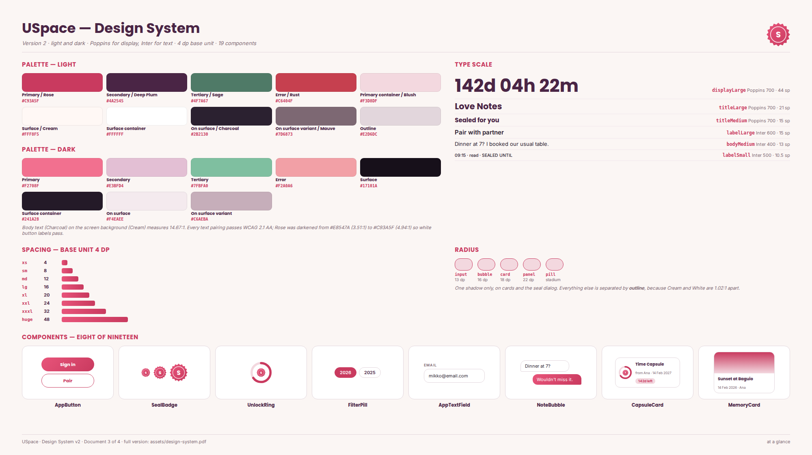

# Design system

The reference I open every time I build a screen. Everything below is what goes into `lib/theme/` on day one — no placeholder values.

[Design system (PDF, 8 pages)](assets/design-system.pdf) — the full version: every role, both schemes as Dart, all 19 components with their constructors, and the screens × components matrix.

**Theme mode: light and dark.** Decided now rather than retrofitted, because the Profile screen has a theme switch and a light-only app would ship a control that does nothing. **Fonts:** Poppins for display and titles, Inter for everything the user reads, both through `google_fonts`.

## Palette

**USpace ships dark only** (`main.dart` pins `ThemeMode.dark`). One palette lives in `lib/theme/us_palette.dart` (`UsPalette`); `AppColors.dark` maps it onto Material roles, and `NotePalette` and the Home quick-action palette now point at the same tokens. Contrast was measured with the WCAG 2.1 relative-luminance formula.

| Token | Hex | Used for | Contrast |
|---|---|---|---|
| `ink` | `#140C14` | Screen background (`surface`) | base |
| `surface` | `#1E1320` | Sections, nav bar, quiet cards | raised |
| `card` | `#2A1426` | Cards, sheets, inputs (`surfaceContainerHighest`) | raised |
| `cardRaised` | `#34182F` | Selected or raised cards | raised |
| `rose` | `#E39AAE` | Primary actions, active nav, links (`primary`) | 8.70:1 on ink |
| `onRose` | `#2A0F1C` | Text and icons on rose | 8.03:1 on rose |
| `roseLight` | `#EDB6C4` | Accent text and icons on dark | 10+:1 on ink |
| `roseDeep` | `#C23F66` | The single strongest call to action, with cream text | 4.59:1 with cream |
| `blush` | `#F3D3DB` | Accent text (`secondary`, `onPrimaryContainer`) | 13.87:1 on ink |
| `cocoa` | `#5A3440` | Dividers and paper shadows only | 1.63:1, never text |
| `cream` | `#FFF3EC` | Primary text (`onSurface`) | 15.72:1 on card |
| `muted` | `#CDB3C0` | Secondary text (`onSurfaceVariant`) | 8.81:1 on card |
| `line` | `#F6A9C1` at 20% | Card and input borders (`outline`) | non-text |
| `sage` | `#7FBFA0` | Done, ready to open (`tertiary`) | 8.04:1 on card |
| `error` | `#F2A0A6` | Errors | 8.44:1 on card |
| `cork` | `#6A4438` | Timeline corkboard surface | surface only, never under text |
| `corkLight` | `#7A5040` | Lighter cork patches | surface only |
| `corkDeep` | `#3E2228` | Board frame shading, tag string holes | surface only |

`primaryContainer` is `#4A1F36`: blush text on it measures 9.84:1. Mood gradients stay in `AppMoodColors` and are used only by the Home mood hero.

**Rule:** no `Color(0x...)` in screens. Colours come from `Theme.of(context).colorScheme` or `UsPalette`. Painted illustrations (wax seal, envelope, quick-action art, scrapbook paper) may keep local shades.

## Type scale

Poppins was retired on 6 Oct 2026. **Playfair Display** is for major headings only: countdowns, hero titles, the capsule reveal and the wordmark. It never goes on labels, buttons, chips or body text. **Inter** is everything else. **Lora** is for letter bodies (Love Notes, Time Capsules), **Caveat** for Timeline handwriting (captions, notes, tape), and **La Belle Aurore**, a lightly joined pen script, for Timeline month tags only (`AppTypography.monthTag`), nowhere else. All live in `lib/theme/app_typography.dart`.

| Slot | Font | Size | Weight | Used for |
|---|---|---|---|---|
| `displayLarge` | Playfair Display | 36 sp | 600 | Countdown numerals, capsule reveal |
| `headlineMedium` | Playfair Display | 26 sp | 600 | Hero titles, the Home mood word |
| `headlineSmall` | Playfair Display | 22 sp | 600 | Smaller hero titles |
| `titleLarge` | Inter | 18 sp | 600 | Screen and sheet titles |
| `titleMedium` | Inter | 15 sp | 600 | Card titles, dialog headings |
| `titleSmall` | Inter | 14 sp | 600 | Small card titles |
| `labelLarge` | Inter | 15 sp | 600 | Button labels |
| `labelMedium` | Inter | 12 sp | 600 | Section labels, chips |
| `bodyLarge` | Inter | 15 sp | 400 | Input text, chat |
| `bodyMedium` | Inter | 14 sp | 400 | Default reading text |
| `bodySmall` | Inter | 13 sp | 400 | Supporting text |
| `labelSmall` | Inter | 11 sp | 500 | Timestamps and captions |

**11 sp is the floor.** Helpers: `AppTypography.display(size)`, `.letter()`, `.hand()`.

## Spacing

**The base unit is 4 dp.** Every gap is a multiple of it, and the working rhythm inside a screen is 8 or 16. In `lib/theme/app_spacing.dart`.

| Token | Value | Used for |
|---|---|---|
| `xs` | 4 | Icon-to-label, chip padding |
| `sm` | 8 | Between related rows, chip gaps |
| `md` | 12 | Inside cards, title to subtitle |
| `lg` | 16 | Card padding, gap between cards |
| `xl` | 20 | Screen side margin on phone |
| `xxl` | 24 | Section spacing, desktop card padding |
| `xxxl` | 32 | Between major blocks on desktop |
| `huge` | 48 | Empty states, the splash block |

Semantic aliases: `screenMargin` (20), `screenMarginWide` (24), `cardPadding` (16), `touchTarget` (48), `railWidth` (220), `navBarHeight` (64).

**Radius** (`AppRadius`): `chip` 8, `input` 12, `card` 16, `sheet` 24, `pill` 999. The older names (`bubble`, `tile`, `panel`, `hero`) now alias these; `chipBar` 4 is only for thin progress bars.
**Depth:** three levels. Flat with a `line` border, `AppShadows.soft`, and `AppShadows.raised` for the one hero card on a screen. No glass or blur.

**Motion** (`AppMotion`): press 90 / 160 ms, `fade` 200 ms, `sheet` 320 ms, `ceremony` 900 ms for rare celebrations. Curves: `enter` easeOutCubic, `snappy` for touch responses; no elastic or bouncing curves. Loops run only on ceremony screens and only while visible. With reduced motion every duration is zero.

**Icons:** USpace's own line set in `assets/icons/` (34 SVGs: 24 px grid, 1.75 stroke, round caps and joins), drawn with `UsIcon(UsIcons.home)` from `lib/widgets/atoms/us_icon.dart`. No emoji in UI chrome; emoji remain only as message content in Chat. Exceptions: the Home 3D mood art and the painted "For us" quick-action art.

**Breakpoints:** Compact `< 600 dp` — single column, bottom nav, seal picker as a bottom sheet. Medium `600–840 dp` — Timeline becomes two columns. Expanded `≥ 840 dp` — side rail, three-column Timeline, seal picker as a centred dialog, and the capsule list and detail share one screen.

## Components

Nineteen widgets, every one used on more than one screen or more than once on a screen.

| Component | What it is | File | Parameters | Screens |
|---|---|---|---|---|
| `AppButton` | Filled, outlined and disabled button in one widget | `lib/widgets/atoms/app_button.dart` | `label`, `onPressed` (null → disabled style), `variant`, `icon?`, `isLoading`, `fullWidth` | Sign in & Pair, Seal dialog, Capsule detail, Profile, Timeline sheet |
| `SealBadge` | The wax seal — the app's signature mark | `lib/widgets/atoms/seal_badge.dart` | `size` (22 / 30 / 46), `state` (sealed \| broken), `color?` | Splash, Home, Love Notes, Time Capsules, Capsule detail |
| `UnlockRing` | Progress ring that fills as the wait elapses | `lib/widgets/atoms/unlock_ring.dart` | `elapsedFraction`, `size`, `strokeWidth`, `child?` | Home, Time Capsules, Capsule detail |
| `AppTextField` | Labelled input with the small-caps label above | `lib/widgets/atoms/app_text_field.dart` | `label`, `controller`, `hintText?`, `prefixIcon?`, `obscureText`, `suffix?`, `validator?` | Sign in & Pair, Add memory, Add bucket item, Profile |
| `FilterPill` | Selectable pill with an optional count badge | `lib/widgets/atoms/filter_pill.dart` | `label`, `selected`, `onTap`, `count?` | Timeline (years), Love Notes (filters), Time Capsules, Bucket List |
| `AvatarCircle` | Initials or photo, optionally overlapped as a pair | `lib/widgets/atoms/avatar_circle.dart` | `initials`, `imageUrl?`, `size`, `overlapped` | Home, Profile, side rail, Timeline |
| `SectionLabel` | Small-caps section heading with an optional action | `lib/widgets/atoms/section_label.dart` | `text`, `actionLabel?`, `onAction?` | Every screen |
| `CountdownText` | Live countdown computed from a date, never a string | `lib/widgets/atoms/countdown_text.dart` | `target` (`DateTime`), `format` (long \| days), `style?` | Home, Love Notes, Time Capsules, Capsule detail |
| `CountdownCard` | The plum anniversary card with its ring | `lib/widgets/molecules/countdown_card.dart` | `anniversary`, `label`, `subtitle?`, `onTap?` | Home |
| `MemoryCard` | Photo, caption, date, favourite — list or grid | `lib/widgets/molecules/memory_card.dart` | `memory`, `onTap`, `onFavourite`, `layout` (list \| grid) | Timeline, Home |
| `NoteBubble` | One note in the thread, sent or received | `lib/widgets/molecules/note_bubble.dart` | `note`, `isMine`, `onLongPress?` | Love Notes |
| `SealedNoteBubble` | A capsule inline in the thread — seal, countdown, redacted lines | `lib/widgets/molecules/sealed_note_bubble.dart` | `capsule`, `onTap`, `isMine` | Love Notes |
| `CapsuleCard` | A capsule as a row or a highlight card | `lib/widgets/molecules/capsule_card.dart` | `capsule`, `onTap`, `selected`, `style` (row \| highlight) | Home, Time Capsules |
| `BucketListTile` | Date idea with its done state | `lib/widgets/molecules/bucket_list_tile.dart` | `item`, `onToggle`, `onEdit?`, `dense` | Bucket List, Home |
| `ActivityRow` | One line of recent activity with a relative time | `lib/widgets/molecules/activity_row.dart` | `title`, `when` (`DateTime`), `dotColor`, `onTap?` | Home |
| `SealPicker` | Date picker for sealing — sheet on phone, dialog on desktop | `lib/widgets/molecules/seal_picker.dart` | `show(context, initialDate, maxDate?)` → `Future<DateTime?>` | Love Notes, Time Capsules |
| `AppShell` | Navigation shell: `NavigationBar` under 840 dp, `NavigationRail` above | `lib/widgets/organisms/app_shell.dart` | `currentIndex`, `onDestinationSelected`, `child` | All five tabs, both widths |
| `NoteComposer` | Write bar with send and seal actions | `lib/widgets/organisms/note_composer.dart` | `onSend`, `onSealTapped`, `controller?` | Love Notes |
| `CapsuleDetailPane` | The full capsule view: ring, countdown, redacted body, actions | `lib/widgets/organisms/capsule_detail_pane.dart` | `capsule`, `onSaveToTimeline`, `onReply?`, `showBackButton` | Capsule — locked, Capsule — opened, Time Capsules (desktop) |

**Conventions.** Each takes a model rather than loose fields. None reads a colour or size literal — everything comes from `Theme.of(context)`, which is what makes the dark scheme work for free. None navigates: callbacks go out and the screen decides. Everything tappable meets the 48 dp minimum.

**Deliberately not components:** `HomeSummaryPanel` (it was the whole screen wearing a component's name), screen scaffolds (the shared part is already `AppShell`), and Splash (a route that decides where to go, so its logic belongs in routing).

## Changes since the last version

**6 Oct 2026 — redesign batch 5 (Timeline corkboard).**

- The Timeline board is warm cocoa cork with a fine speckle (`CorkSurface`, `lib/widgets/timeline/cork_surface.dart`), anchored to board coordinates, in a thin wooden frame (`BoardFrame`) sized to what is on the board and hung on the plum background. The floating hearts, month glow and doodles behind the board are gone.
- One month label everywhere: a cream paper tag with a rose pin, lettered in La Belle Aurore (`MonthTag`). The year stamp is retired. When zoomed out, the board's tags fade out before the floating ones fade in, so a month never shows twice; floating tags never overlap.
- The Timeline opens on the newest month's tag (or the New memories strip).
- Header, dates toggle and editor toolbar use the USpace icon set (57 icons).

**6 Oct 2026 — v3, redesign batch 1 (foundation).**

- Dark-only palette in `UsPalette`; primary moves from hot pink `#F2708F` to dusty rose `#E39AAE`. Love Notes, quick-action and Therabot colours now read the same tokens.
- Poppins dropped: Playfair Display for major headings only, Inter elsewhere; body text 13 to 14 sp.
- Radii collapsed to five values; motion tokens added; the gesture pulse no longer uses an elastic bounce.
- Emoji replaced by the USpace icon set in memory tags, mood picker, activity lines, Therabot, Work it out and the celebration effects.
- Button, chip, divider and progress themes set once in `AppTheme`, so raw Material buttons match `AppButton`.

**20 Sep 2026 — v2, written after the mockup.**

- **Palette written as a real `ColorScheme`.** The prelim's `color.primary` style tokens could not be pasted into a project. Building screens also showed I needed container and on-container roles for the blush pills and the sage ready-to-open card.
- **Dark scheme added.** The prelim assumed light. My Profile wireframe already draws a theme switch, so light-only would ship a dead control.
- **Rose `#C93A5F` kept**, not revisited: the mockup put white labels on rose in five places and the measured 4.94:1 still passes.
- **Type scale re-measured at 360 dp.** Countdown 28 → 44 sp, body 15 → 13 sp, and a 10.5 sp floor after the hi-fi sheet drifted to 9 sp.
- **Spacing base unit stated: 4 dp.** This was the feedback on the prelim, and it resolved a real contradiction — my mockup legend claimed an 8 dp grid while using a 20 dp margin. 20 is 5 × 4.
- **Components 9 → 19**, each with a file path and a constructor. The seal family (`SealBadge`, `UnlockRing`, `SealedNoteBubble`, `CapsuleCard`, `SealPicker`, `CapsuleDetailPane`) did not exist at prelim because Time Capsule did not either.
- **`AppNavBar` → `AppShell`.** The desktop mockup showed the rail is the same component at a different width, not a second widget that would drift.
- **`CountdownText` added.** The walkthrough caught Home saying "142 days" and a capsule saying "12d 04h" for the same unlock date. Computing from the date in one widget makes that impossible.
- **`HomeSummaryPanel` dropped** — it appeared once and took every piece of Home's state, so it was a screen.
